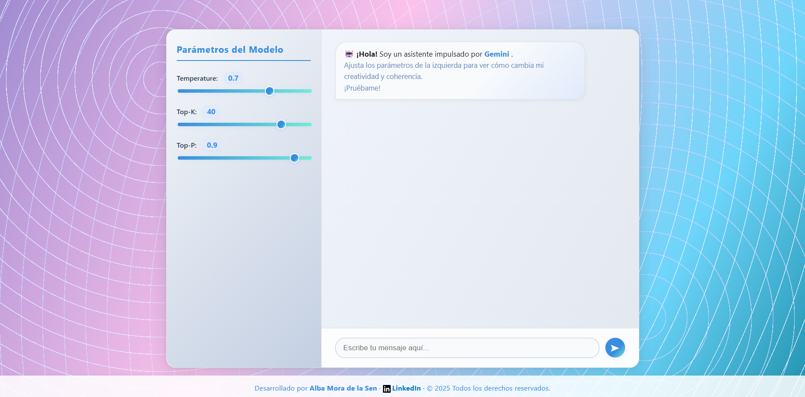

# Chatbot con Gemini

Este proyecto es una aplicación web interactiva que permite conversar con un chatbot impulsado por la inteligencia artificial de Gemini. El usuario puede ajustar parámetros como la creatividad y la coherencia de las respuestas (temperature, top-k, top-p) para experimentar diferentes estilos de conversación y resultados.

El diseño de la interfaz es moderno, atractivo y adaptable, con un enfoque visual inspirado en gradientes morados y azules. El frontend está conectado a un backend que gestiona las peticiones al modelo de lenguaje, ofreciendo una experiencia fluida y personalizable.

Ideal para quienes desean explorar el potencial de los modelos generativos y experimentar con la configuración de sus respuestas en tiempo real.

